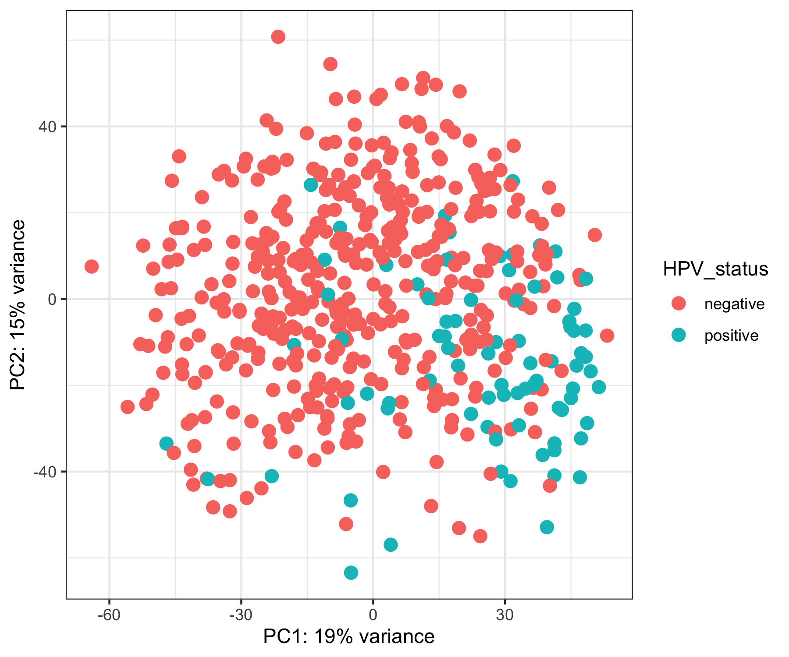
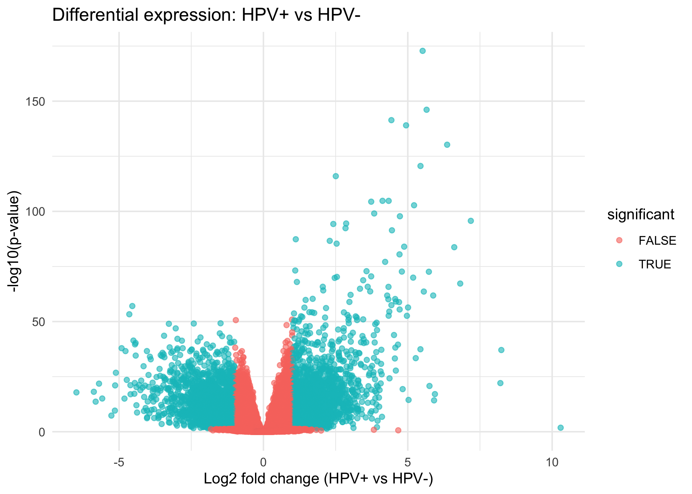

# computational_cancer_Hackathon_2025
HNSCC transcriptome analysis and logica building

## R packages

- Bioconductor
- TCGAbiolinks
- DESeq2
- ggplot
  
## Data
https://portal.gdc.cancer.gov/projects/TCGA-HNSC

## Downloading
#Doownload the data from GDC data base

query <- GDCquery(
  project = "TCGA-HNSC",
  data.category = "Transcriptome Profiling",
  data.type = "Gene Expression Quantification",
  workflow.type = "STAR - Counts",
  sample.type = c("Primary Tumor")
)
GDCdownload(query)

raw_count_1 <- GDCprepare(query,summarizedExperiment = TRUE)

Clinical data

query_cli <- GDCquery(project = "TCGA-HNSC",
                  data.category = "Clinical",
                  data.type = "Clinical Supplement"
                  )
GDCdownload(query_cli)
## Data filtering
- Desq2 for genes and patient filtering
- Filtering patient base on Pharinx or oral cavity tissu
- Check for patient with metastasis
- HC to control patient HBV+ and HBV-

### NOTE AND ADDITIONS FROM NAGWA (analysis + visualisations)

- Implemented PCA analysis using variance-stabilised data to assess global structure between HPV+ and HPV– HNSCC tumours.
- Created `PCA_plot.png` (saved in /results) showing partial overlap between groups, indicating limited global transcriptomic separation.
- Added DESeq2 differential expression analysis comparing HPV+ vs HPV– tumours.
- Generated DE results tables:
  - `DE_results.csv`
  - `DE_results.rds`
- Added volcano plot visualisation (`Volcano_plot.png`) highlighting significantly up- and down-regulated genes between HPV groups.
- Updated `data_analysis_hackathon.R` to include:
  - PCA saving code  
  - DESeq2 pipeline  
  - Volcano plot generation  
  - Automated saving of outputs into /results

### Key Findings From Volcano Plot

So what i have found the volcano plot reveals a clear asymmetry, with a larger number of genes significantly upregulated in HPV‑positive tumours, shown by the enriched significant points on the right side of the plot.

Only a small number of significant genes appear downregulated in HPV‑positive tumours, indicating the biological impact of HPV is primarily associated with increased expression of certain genes. This pattern suggests that HPV infection drives distinct transcriptional activity, potentially related to viral response pathways, immune signalling, and tumour behaviour. These results support the idea that HPV+ HNSCC tumours possess a unique gene expression profile compared to HPV– tumours, even though PCA shows limited global separation.

The volcano plot shows a strong asymmetry, many more genes are significantly upregulated in HPV-positive tumors compared to HPV-negative ones. This indicates HPV infection induces a distinct transcriptional activation signature, even though PCA shows only subtle global differences.

